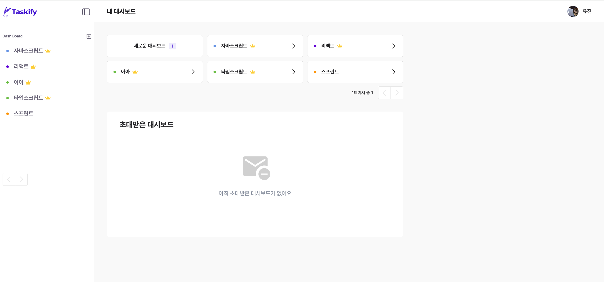
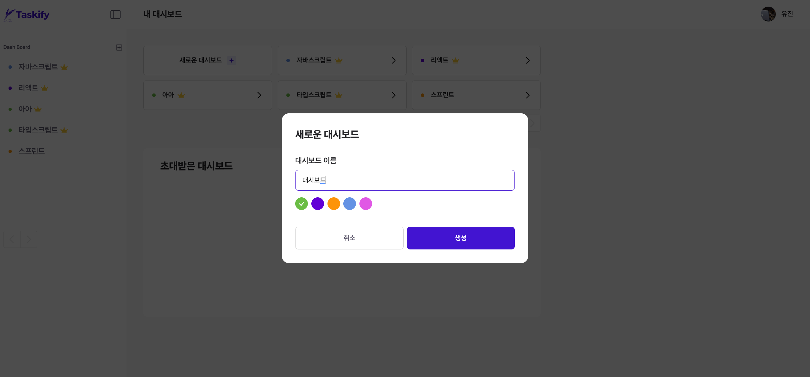
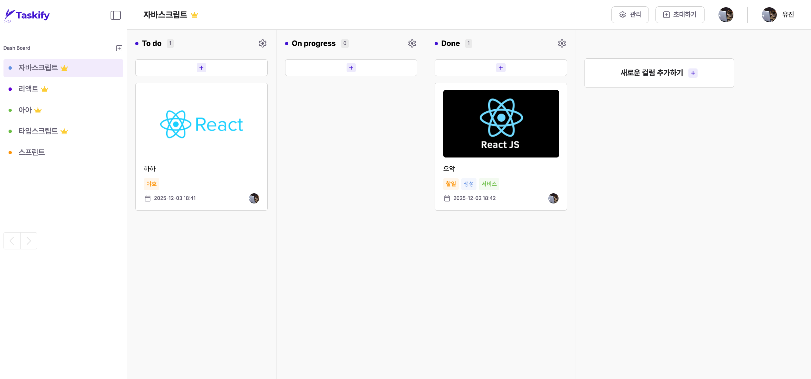
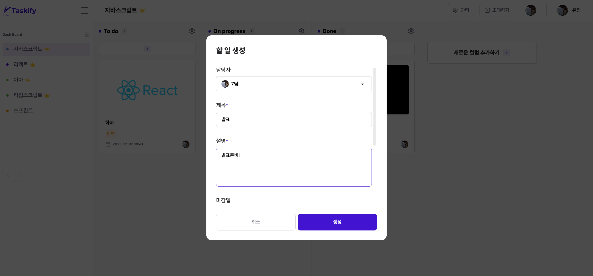
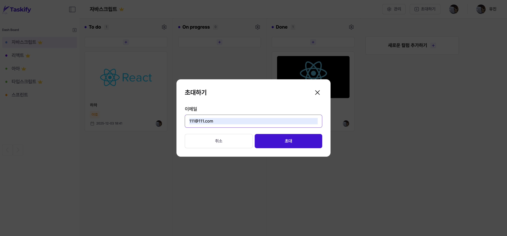
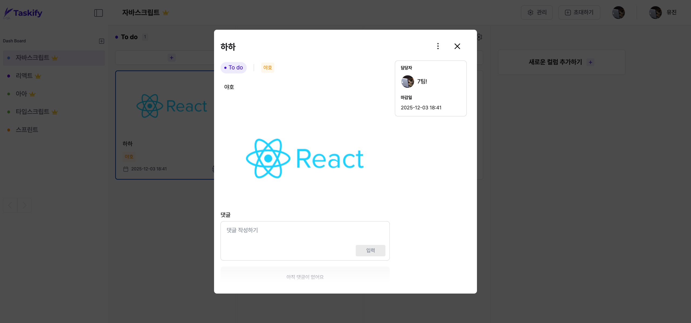
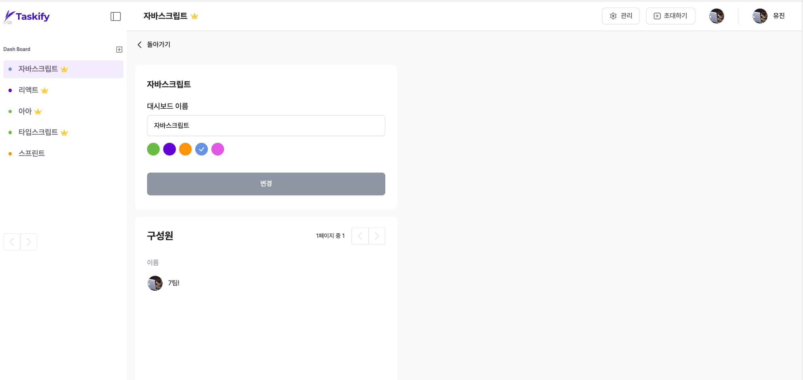
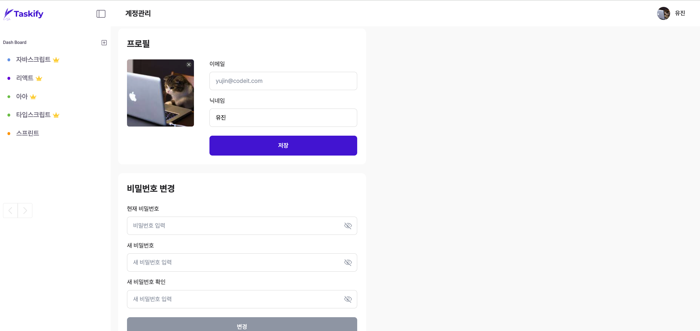

# ⏰ Taskify - 일정 관리 대시보드

<p align="center">
  
</p>

## 🚩 프로젝트 소개

**Taskify**는 일정 관리와 공유 기능을 제공하는 웹 애플리케이션으로, 사용자가 가족, 회사 등 다양한 커뮤니티를 생성하고 멤버를 초대하여 함께 일정을 관리할 수 있는 서비스입니다. 커뮤니티 내에서 등록된 일정은 카드 형태로 멤버들에게 공유되며, 할 일 목록 생성·게시·수정·삭제와 같은 CRUD 기능을 구현했습니다. 또한 멤버 초대, 카테고리 분류, 검색, 댓글 기능 등을 통해 유기적인 협업 환경을 구성했습니다.

TypeScript 기반으로 복잡한 상태에서도 안정적인 코드를 유지할 수 있도록 설계했으며, 할 일 카드, 모달 등 다양한 UI 요소를 활용해 가독성과 사용성을 높였습니다.

협업 도구나 일정 관리 시스템에 관심 있는 학생들에게 적합한 프로젝트입니다.

👉 **[✉️ Taskify 바로가기](https://taskify-frontend-jet.vercel.app/)**

---

## 📅 프로젝트 수행

- **프로젝트 기간:** 2025. 11. 17(월) ~ 2025.12.4(목)
- **주제 선정 & 계획 수립:** 2025. 11. 17(월) ~ 2025.11.19(수)
- **기능 구현:** 2025.11.19(수) ~ 2025.12.02(화)
- **중간 점검:** 2025.11.29(토)
- **버그 / 테스트:** 2025.12.01(월) ~ 2025.12.04(목)
- **팀 소통:** Discord 코어타임 + GitHub Issue 기반 트래킹

---

## 💁 팀원 소개

| <div align=center>팀장                                       | <div align=center>팀원                                 | <div align=center>팀원                                  |
| ------------------------------------------------------------ | ------------------------------------------------------ | ------------------------------------------------------- |
|                     |               |                |
| <div align=center>[이아름](https://github.com/aahreum)</div> | <div align=center>[정우연](https://github.com/jung518) | <div align=center>[현유진](https://github.com/yujin-fe) |

## 📋 역할 분배

| 이름   | 역할    | 담당                                                                                                                                                                                                                                                              |
| ------ | ------- | ----------------------------------------------------------------------------------------------------------------------------------------------------------------------------------------------------------------------------------------------------------------- |
| 이아름 | 팀장 FE | 프로젝트 기초 세팅 <br> 공통 컴포넌트(tag / Avatar Fallback / Dropdown / Combobox / Input / Header) <br> 메인페이지 <br> 로그인/회원가입 레이아웃 <br> 로그인 페이지 및 기능 <br> 라우터 추가 <br> 마이페이지 <br> 대시보드 상세페이지 <br> 커스텀 훅 · 공통 함수 |
| 정우연 | 팀원 FE | 테일윈드 세팅 <br> 공통 컴포넌트(title / 이미지 폼 / label / 기본 모달 / 대시보드 테이블 레이아웃) <br> 대시보드 수정 페이지                                                                                                                                      |
| 현유진 | 팀원 FE | Vercel 배포 GitHub Actions <br> 공통컴포넌트(avatar / 버튼 / 폼 모달 / 대시보드 사이드바/ 대시보드 레이아웃) <br> 회원가입 페이지 <br> 내 대시보드 페이지 <br> 커스텀 훅                                                                                          |

---

## 🧑‍💻 기술 스택

### 📚 라이브러리

[](https://reactjs.org/)
[](https://reactrouter.com/)
[](https://axios-http.com/)
[](https://tailwindcss.com/)
[](https://reactjs.org/docs/context.html)

- **React** – UI 라이브러리
- **React Router** – 클라이언트 라우팅
- **Axios** – HTTP 요청
- **Tailwind CSS** – 유틸리티 기반 스타일링
- **React Context** – 전역 상태관리

### ⚙ 빌드 & 개발 도구

[](https://www.npmjs.com/) [](https://vitejs.dev/) [](https://github.com/vitejs/vite-plugin-react) [](https://react-svgr.com/)

- **npm** → 패키지 매니저
- **Vite** – 프론트엔드 빌드 도구
- **Vite Plugin React** – Vite에서 React 지원 플러그인
- **Vite Plugin SVGR** – SVG를 React 컴포넌트로 변환

### 🔎 코드 품질

[](https://eslint.org/) [](https://prettier.io/) [](https://typicode.github.io/husky/) [](https://github.com/okonet/lint-staged) [](https://commitlint.js.org/)

- **ESLint** – 코드 품질 검사 도구
- **Prettier** – 코드 포맷팅 도구
- **Husky** – Git 훅 관리
- **lint-staged** – 커밋 전 코드 린트 실행
- **Commitlint** – 커밋 메시지 규칙 검사

### 🚀 배포 & CI/CD

[](https://vercel.com/) [](https://github.com/features/actions)

- **Vercel** – 배포 플랫폼
- **GitHub Actions** – CI/CD 자동화
- **GitHub** – 버전 관리 및 협업

### 🤝 협업 도구

[](https://github.com/) [](https://www.notion.so/) [](https://discord.com/) [](https://www.figma.com/)

- **Notion** – 문서화 및 협업
- **Discord** – 실시간 커뮤니케이션
- **Figma** – 디자인 및 프로토타이핑

---

## 🗂️ 디렉토리 구조

```
📦 Taskify-Frontend
 ┣ 📂.github                     # GitHub 이슈 및 PR 템플릿 관리
 ┣ 📂.husky                      # Git Hook 설정 (pre-commit, commit-msg)
 ┣ 📂.vscode                     # VSCode 개발 환경 설정 (확장, 스니펫, 설정 등)
 ┣ 📂 public                     # 웹폰트 리소스, 브라우저 탭 아이콘, 오픈그래프용 대표 이미지
 ┣ 📂 src
 ┃ ┣ 📂 assets                   # 정적 리소스
 ┃ ┃ ┣ 📂 icons
 ┃ ┃ ┣ 📂 images
 ┃ ┃ ┗ 📂 logos
 ┃ ┣ 📂 components               # UI 컴포넌트
 ┃ ┃ ┣ 📂 auth                   # 로그인 회원가입 페이지 관련 컴포넌트
 ┃ ┃ ┣ 📂 common                 # 버튼, 모달, 인풋 등 공용 컴포넌트
 ┃ ┃ ┣ 📂 dashboard              # 대시보드 전용 컴포넌트
 ┃ ┃ ┣ 📂 dashboard-detail       # 대시보드 상세 페이지 전용 컴포넌트
 ┃ ┃ ┣ 📂 editpage               # 대시보드 수정 페이지 전용 컴포넌트
 ┃ ┃ ┣ 📂 home                   # 메인 페이지 전용 컴포넌트
 ┃ ┃ ┣ 📂 mydashboard            # 내 대시보드 페이지 전용 컴포넌트
 ┃ ┃ ┣ 📂 mypage                 # 내 정보 페이지 관련 컴포넌트
 ┃ ┃ ┗ 📂 skeleton               # 스켈레톤 컴포넌트
 ┃ ┣ 📂constants                # 상수 정의
 ┃ ┣ 📂context                  # 전역 상태 관리
 ┃ ┣ 📂hooks                    # 커스텀 훅
 ┃ ┣ 📂lib
 ┃ ┃ ┣ 📂 apis                  # api 관련 함수
 ┃ ┃ ┗ 📂 axios                 # axios 관련 파일
 ┃ ┣ 📂pages                    # 라우트 단위 페이지
 ┃ ┣ 📂router                   # 라우팅 설정
 ┃ ┣ 📂style                    # 전역 스타일, Tailwind 유틸
 ┃ ┗ 📂utils                    # 공용 유틸 함수
 ┣ 📜App.tsx
 ┣ 📜main.tsx
 ┣ 📜index.html
 ┣ 📜vite.config.ts             # Vite 빌드 설정
 ┣ 📜vercel.json                # Vercel 배포 설정
 ┣ 📜eslint.config.js           # ESLint 규칙
 ┣ 📜commitlint.config.js       # Commitlint 규칙
 ┣ 📜.prettierrc                # Prettier 포맷 설정
 ┣ 📜.prettierignore
 ┣ 📜.gitignore
 ┣ 📜.env                       # 환경 변수 파일(로컬에서 관리)
 ┗ 📜README.md
```

## 🖥️ 미리보기

| 페이지         | 화면                                     |
| -------------- | ---------------------------------------- |
| 내 대시보드    |    |
| 대시보드 추가  |   |
| 대시보드 상세  |    |
| 할일 생성      |  |
| 구성원 초대    |   |
| 할일 상세 조회 |  |
| 대시보드 관리  |  |
| 계정 관리      |  |

## 🔗 Link

- [배포 사이트](https://taskify-frontend-jet.vercel.app/)
- [Wiki](https://github.com/sprint-19-part3-7team/Taskify-Frontend/wiki)
- [시연 영상](https://youtu.be/6mZkO7UfjLE)
